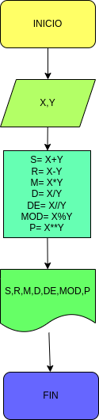

# Ejercicio N° 3

## Calcula la suma, resta, multiplicacion, division, division entera, modulo, potencia de X y Y

# ANALISIS

Variables de entrada (imput)

X: Primer valor de ingresado
Y: Segundo valor de ingresar

variable del proceso y salida (processing,storange,output)

S: Suma
R: Resta
M: Multiplicacion
D: Division
DE: Division entera
MOD: Modulo
P: Potencia

# DISEÑO

# CONSTRUCCION
